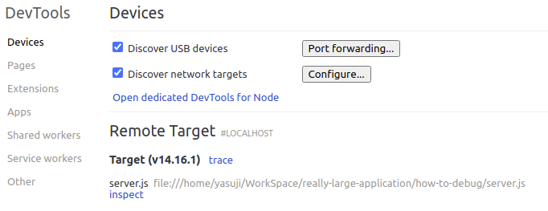
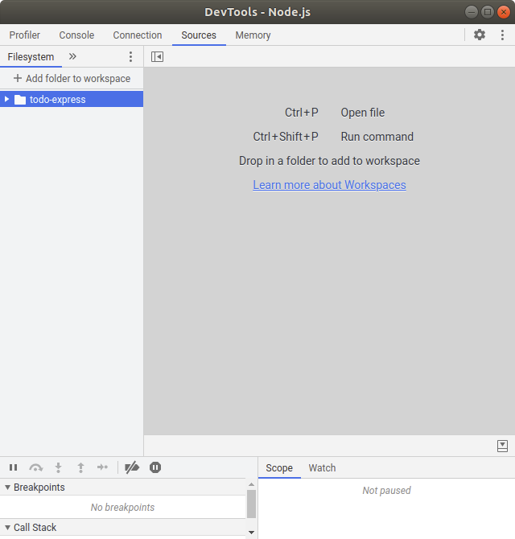
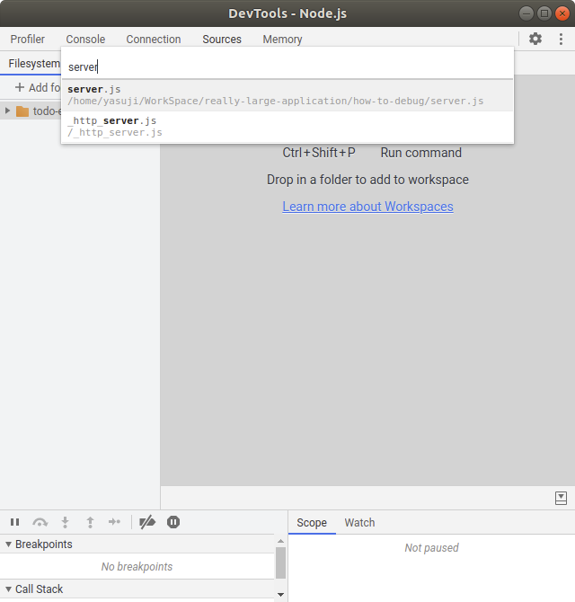

# How To Debug

[How To Debug Node.js with the Built-In Debugger and Chrome DevTools](https://www.digitalocean.com/community/tutorials/how-to-debug-node-js-with-the-built-in-debugger-and-chrome-devtools)

デバッグする方法

## Step1 Using Watchers

ウォッチャーの使用

```js
const orders = [341, 454, 198, 264, 307];
let totalOrders = 0;

for (let i = 0; i < orders.length; i++) {
  totalOrders += orders[i];
}

console.log(totalOrders);
```

```shell
$ node badLoop.js
NaN
```

```shell
$ node inspect badLoop.js
< Debugger listening on ws://127.0.0.1:9229/703087e2-7956-4465-8e4c-b1c3d5c3479f
< For help, see: https://nodejs.org/en/docs/inspector
< Debugger attached.
Break on start in badLoop.js:1
> 1 const orders = [341, 454, 198, 264, 307]; // 先頭行で停止
  2 let totalOrders = 0;
  3
debug>
```

- `c` or `cont`: 次のブレークポイントまたはプログラムの最後まで実行を続行
- `n` or `next`: 次の行に移動
- `s` or `step`: ステップイン
- `o`: ステップアウト
- `pause`: 一時停止

```shell
  1 const orders = [341, 454, 198, 264, 307];
> 2 let totalOrders = 0; // `n`で移動
  3
```

```shell
  3
> 4 for (let i = 0; i <= orders.length; i++) { // `n`で移動,0ハイライト
  5   totalOrders += orders[i];
  6 }
debug> watch('totalOrders') // ウォッチ追加
debug> watch('i') // ウォッチ追加
```

```shell
break in badLoop.js:4
Watchers:
  0: totalOrders = 0 // ウォッチの値
  1: i = 0 // ウォッチの値

  2 let totalOrders = 0;
  3
> 4 for (let i = 0; i <= orders.length; i++) {
```

```shell
debug> n
break in badLoop.js:4
Watchers:
  0: totalOrders = 341 //forループを一度抜けた結果
  1: i = 0

  2 let totalOrders = 0;
  3
> 4 for (let i = 0; i <= orders.length; i++) {
  5   totalOrders += orders[i];
  6 }
```

```shell
  0: totalOrders = 1564 // `n`にてデバッグを進める
  1: i = 5

  2 let totalOrders = 0;
  3
> 4 for (let i = 0; i <= orders.length; i++) {
  5   totalOrders += orders[i];
  6 }
```

```shell
  0: totalOrders = NaN
  1: i = 6 // 6回ループしている

  2 let totalOrders = 0;
  3
> 4 for (let i = 0; i <= orders.length; i++) {
  5   totalOrders += orders[i];
  6 }
debug> `Ctrl+D`でデバッグ終了
```

```js
// ループ需要権見直し
for (let i = 0; i < orders.length; i++) {
```

```shell
$ node badLoop.js
1564 // 正しい結果
```

## Step2 Using Breakpoints

ブレークポイントの使用

`sentences.txt`

```txt
Whale shark ... areas of the body
```

`textHelper.js`

```js
import fs from 'fs';

const readFile = () => {
  const data = fs.readFileSync('sentences.txt');
  const sentences = data.toString();
  return sentences;
};

const getWords = (text) => {
  let allSentences = text.split('\n');
  let flatSentence = allSentences.join(' ');
  let words = flatSentence.split(' ');
  words = words.map((word) => word.trim().toLowerCase());
  return words;
};

const countWords = (words) => {
  let map = {};
  words.forEach((word) => {
    if (word in map) {
      map[word] = 1;
    } else {
      map[word] += 1;
    }
  });

  return map;
};

export { readFile, getWords, countWords };
```

`index.js'

```js
import * as textHelper from './textHelper.js';

const stopwords = [
  'i',
  'me',
  ...
  'now',
  '',
];

const sentences = textHelper.readFile();
const words = textHelper.getWords(sentences);
const wordCounts = textHelper.countWords(words);

let max = -Infinity;
let mostPopular = '';

Object.entries(wordCounts).forEach(([word, count]) => {
  if (stopwords.indexOf(word) === -1) {
    if (count > max) {
      max = count;
      mostPopular = word;
    }
  }
});

console.log(`本文中で最も人気のある単語は「${mostPopular}」で、${max}回出現します。`);
```

```shell
$ node index.js
本文中で最も人気のある単語は「whale」で、1回出現します。
```

答えが間違っている。`textHelper.js`に`debugger`関数を設定

```js
const readFile = () => {
  ...
  debugger;
  return sentences;
};

const getWords = (text) => {
  ...
  debugger;
  return words;
};

const countWords = (words) => {
  ...

  debugger;
  return map;
};
```

デバッグ開始

```shell
$ node inspect index.js
< Debugger listening on ws://127.0.0.1:9229/e33e2dcd-6830-4584-accd-b777a0352c1e
< For help, see: https://nodejs.org/en/docs/inspector
< Debugger attached.
Break on start in textHelper.js:1
> 1 import fs from 'fs';
  2
  3 const readFile = () => {
debug> c // 次のブレークポイントへ移動
break in textHelper.js:6
  4   const data = fs.readFileSync('sentences.txt');
  5   const sentences = data.toString();
> 6   debugger;
  7   return sentences;
  8 };
debug> watch('sentences') // ウォッチ設定
debug> n // 次の行に移動
break in textHelper.js:7
Watchers:
  0: sentences =
    'Whale ... the body\n'

  5   const sentences = data.toString();
  6   debugger;
> 7   return sentences;
  8 }; // ファイル読み取りはOK
debug> c // 次のブレークポイントへ移動
break in textHelper.js:15
Watchers:
  0: sentences =
    ReferenceError: sentences is not defined
        ...
        at async Object.loadESM (internal/process/esm_loader.js:68:5)

 13   let words = flatSentence.split(' ');
 14   words = words.map((word) => word.trim().toLowerCase());
>15   debugger;
 16   return words;
 17 };
debug> unwatch('sentences') // ウォッチ解除
debug> watch('words') // getWords()関数の戻り値`words`をウォッチ
debug> n // 次の行に移動
break in textHelper.js:16
Watchers:
  0: words =
    [ 'whale',
      'shark',
      ...
      'distinctive',
      ... ]

 14   words = words.map((word) => word.trim().toLowerCase());
 15   debugger;
>16   return words;
 17 }; // 正しく小文字に変換されている
 18
debug> unwatch('words') // ウォッチ解除
debug> c // 次のブレークポイントへ移動
break in textHelper.js:29
 27   });
 28
>29   debugger;
 30   return map;
 31 };
debug> watch('map') // countWords関数の戻り値`map`をウォッチ
debug> n // 次の行に移動
break in textHelper.js:30
Watchers:
  0: map =
    { 12: NaN,
      14: NaN,
      15: NaN,
      18: NaN,
      39: NaN,
      59: NaN,
      whale: 1,
      shark: 1,
      rhincodon: 1,
      typus: NaN,
      gigantic: NaN,
      ... }

 28
 29   debugger;
>30   return map;
 31 };
 32
```

間違えている。`Ctrl+D`でデバッグ終了。`readFile()`と`getWords()`の` debugger`を削除。`countWords()`の`debugger`位置を変更

```js
const countWords = (words) => {
  let map = {};
  words.forEach((word) => {
    debugger;
    if (word in map) {
      map[word] = 1;
    } else {
      map[word] += 1;
    }
    debugger;
  });

  return map;
};
```

デバッグ開始

```shell
$ node inspect index.js
< Debugger listening on ws://127.0.0.1:9229/de091bfc-192e-4b3e-9e9d-a6c3efa9dbee
< For help, see: https://nodejs.org/en/docs/inspector
< Debugger attached.
Break on start in textHelper.js:1
> 1 import fs from 'fs';
  2
  3 const readFile = () => {
debug> watch('word')
debug> watch('word in map') // 式もウォッチ可能
debug> watch('map[word]')
debug> watch('word.length') // 関数結果式もウォッチ可能
debug> c // 次のブレークポイントへ
break in textHelper.js:20
Watchers:
  0: word = 'whale'
  1: word in map = false
  2: map[word] = undefined
  3: word.length = 5

 18   let map = {};
 19   words.forEach((word) => {
>20     debugger;
 21     if (word in map) {
 22       map[word] = 1;
debug> c // 次のブレークポイントへ
break in textHelper.js:26
Watchers:
  0: word = 'whale'
  1: word in map = true
  2: map[word] = NaN // 問題発生
  3: word.length = 5

 24       map[word] += 1;
 25     }
>26     debugger;
 27   });
 28
```

ループの開始時に、`map ['whale']`は未定義。`undefined +1`は数値ではなく`NaN`に評価される。

```shell
Watchers:
  0: word in map = false
  1: map[word] = undefined
```

`textHelpler.js`修正

```js
const countWords = (words) => {
  let map = {};
  words.forEach((word) => {
    debugger;
    if (!(word in map)) {
      // if (word in map) {
```

```shell
$ node index.js
本文中で最も人気のある単語は「whale」で、3回出現します。
```

## Chrome DevTools

`server.js`

```js
import http from 'http';

const host = 'localhost';
const port = '8000';

const greetings = ['Hello world', 'Hola mundo', 'Bonjour le monde', 'Hallo Welt', 'Salve mundi'];

const getGreeting = () => {
  const greeting = greetings[Math.floor(Math.random() * greetings.length)];
  return greeting;
};
```

```shell
$ $ node --inspect-brk server.js // Chromeデバッガーを起動
Debugger listening on ws://127.0.0.1:9229/6e10ffe3-bac7-45b6-ba3f-d116e4813711
For help, see: https://nodejs.org/en/docs/inspector
Server is running on http://localhost:8000
```

**Google Chrome**に`chrome://inspect`と入力。`chrome://inspect/#devices`に遷移し、下図のページが表示される。



`Devices`->`Open dedicated DevTools for Node`をクリック。新しいウィンドウが開く。`Sources`ボタンをクリック。



`Ctrl+P`で目的のプログラムソースを指定



10行目`return greeting;`にブレークポイントを設定

思うように**Chorme**でデバッグできない。
